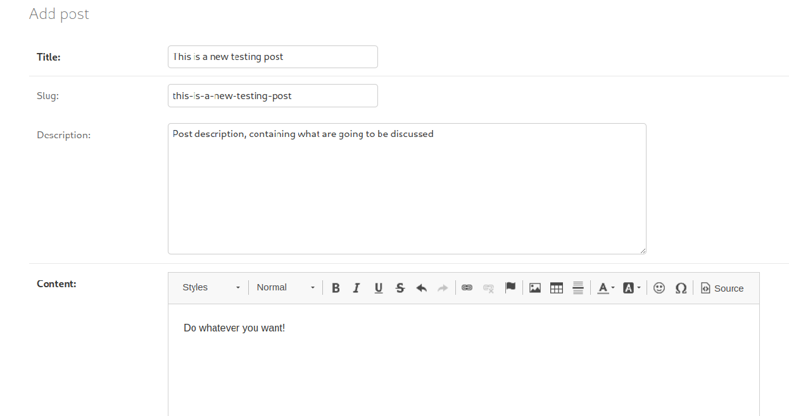

### ✨🚀 **High Performant Personal Blog API**, with user interface for managing posts and a small set of clean features.

<small>* Powered by `django-ninja` REST framework.</small>

---

 - [Awesome Features](#features)
 - Why High Performant APIs over DRF* (building)
 - [Screenshots](#screenshots)
 - [LICENSE](#license)

---

### 📙 Awesome Features:

- [x]  **Management Panel** for _easiest control of blog features_ (posts, tags and more.);
- [x] **Automatic management of slugs**, for _better looking URLs_;
- [x] **Automatic generation of API Documentation** using **SwaggerUI/OpenAPI**, _which can be found at `/docs` and `/openapi.json` endpoints_.
- [x] **Database optimized for performance**(including _query optimizations, pagination and cache_)
- [x]  **Rich Text Editor** (**CKEditor**) content manager, _for creating any kinds of blog posts_.
- [x] **High Performant API** using _**ASGI** for better handling for async requests_.

## Screenshots 

---
## LICENSE 

This project is licensed under the terms of the [MIT license](LICENSE).